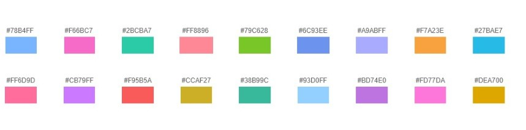

# 颜色说明

#### 默认配色
图表默认使用配色如下：
配置项config.color中可简写作: 'normalColor'

    '#78b4ff', '#f66bc7', '#2bcba7', '#ff8896', '#79c628', '#6c93ee', '#a9abff', '#f7a23f', '#27bae7', '#ff6d9d', '#cb79ff', '#f95b5a', '#ccaf27', '#38b99c', '#93d0ff', '#bd74e0', '#fd77da', '#dea700'
    

    
#### 水质Ⅰ~ 劣Ⅴ类配色 
配置项config.color中可简写作: 'waterGradesColor'

    '#68cffe', '#49a1fe', '#37b70c', '#fae521', '#f29c00', '#dd3f36'
 
#### 合并1，2类的水质级别颜色 
配置项config.color中可简写作: 'merge1n2WaterGradesColor'

    '#68cffe', '#37b70c', '#fae521', '#f29c00', '#dd3f36'
    
#### 富营养状态等级颜色 
配置项config.color中可简写作: 'eutrophicationColor'

    '#68cffe', '#37b70c', '#fae521', '#f29c00', '#dd3f36'
 
#### 空气质量 优 ~ 严重污染颜色 
配置项config.color中可简写作: 'airGradesColor'

    '#37b70c', '#fae521', '#f29c00', '#dd3f36', '#b3013f', '#a00398'
 
